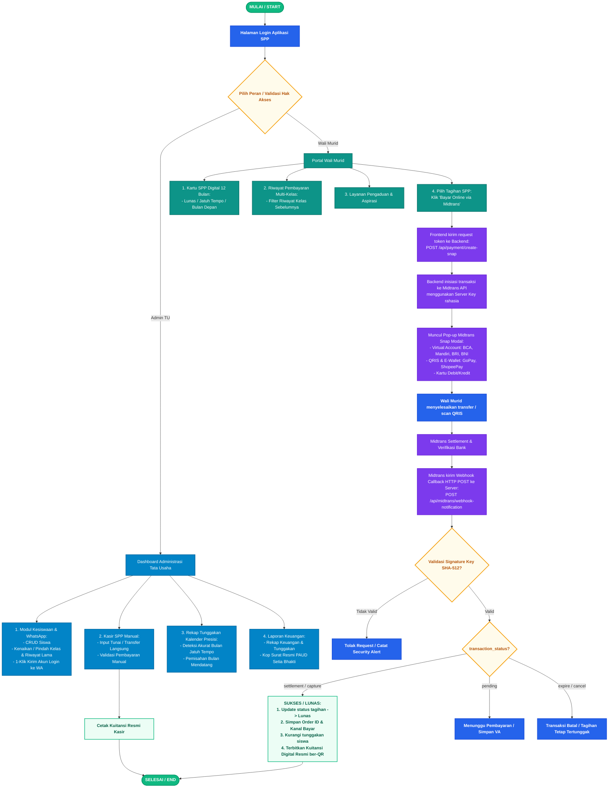

# Dokumentasi & Flowchart Alur Sistem Informasi SPP PAUD Setia Bhakti
## Integrasi Digital Payment Gateway Midtrans (Snap API & Webhook Notification)

Dokumen ini memuat perancangan sistem dan diagram alur kerja (*flowchart*) menyeluruh untuk **Aplikasi SPP PAUD Setia Bhakti**, yang dapat langsung dilampirkan pada laporan tugas akhir, skripsi, maupun laporan proyek/PKL.

---

### 1. Berkas Diagram Alur (Tersedia dalam Format Gambar & Vektor)

Berkas diagram telah disimpan langsung di direktori utama proyek:

| Berkas | Format | Keterangan & Penggunaan |
| :--- | :--- | :--- |
| **`Flowchart_Alur_Sistem_SPP_Midtrans.png`** | **Gambar PNG (Raster)** | Siap *copy-paste* langsung ke Microsoft Word, Google Docs, atau slide PPT presentasi. |
| **`Flowchart_Alur_Sistem_SPP_Midtrans.jpg`** | **Gambar JPEG** | Alternatif gambar dengan ukuran file terkompresi. |
| **`Flowchart_Sistem_SPP_Midtrans_Lengkap.svg`** | **Vektor SVG (Ultra Sharp)** | Skala vektor tanpa pecah (300+ DPI), didukung langsung oleh Microsoft Office & browser. |
| **`flowchart_view.html`** | **Halaman Interaktif** | Dapat dibuka di browser (`http://localhost:3000/flowchart_view.html`) dengan tombol cetak & unduh PDF/PNG. |

---

### 2. Diagram Visual Alur Sistem

---

### 3. Diagram Alur Terstruktur (Mermaid Format)

---

### 4. Penjelasan Naratif Alur Bisnis untuk Laporan

#### A. Alur Autentikasi Dual-Role (Keamanan & Akses Terpisah)
1. Pengguna membuka URL aplikasi sistem SPP.
2. Tersedia tab login dual-role:
   - **Admin TU:** Memasukkan kredensial administrator (Username & Password).
   - **Wali Murid:** Memasukkan Nomor Induk Siswa (NIS) dan kata sandi akun siswa.
3. Setelah submit, layar menampilkan animasi loading bar transisi putih mewah dengan logo resmi **PAUD Setia Bhakti** berputar halus.
4. Sistem memverifikasi sesi dan mengarahkan pengguna ke dashboard yang sesuai.

#### B. Alur Kerja Modul Tata Usaha (Admin TU)
1. **Manajemen Data Siswa:**
   - Melakukan pendaftaran siswa baru, pembaharuan profil, foto siswa, dan penonaktifan siswa lulus/pindah.
   - **Fitur Kenaikan/Pindah Kelas:** Admin dapat memindahkan anak (misal: PAUD A ke PAUD B), dan sistem secara otomatis mencatat riwayat kelas terdahulu (*historical class records*) sehingga data pembayaran di kelas sebelumnya tidak hilang.
   - **Integrasi WhatsApp:** Satu klik tombol WhatsApp pada baris siswa untuk mengirimkan pesan otomatis berisikan data akun login (NIS & Password) dan tautan portal sekolah.
2. **Kasir Keuangan SPP Manual:**
   - Melayani pembayaran langsung di sekolah (Tunai atau Transfer ke rekening yayasan).
   - Petugas menginput nominal, tanggal, dan catatan penerimaan.
   - Status tagihan siswa pada bulan terkait langsung berubah menjadi **Lunas**, dan kuitansi fisik siap dicetak.
3. **Rekap Tunggakan Kalender Presisi:**
   - Sistem memvalidasi tanggal kalender riil: bulan yang belum jatuh tempo (bulan mendatang di tahun ajaran aktif atau tahun masa depan) **tidak dihitung sebagai tunggakan**, melainkan dikategorikan *'Belum Jatuh Tempo'*.
   - Data tunggakan hanya menghitung bulan-bulan yang telah terlewati dan belum berstatus lunas.
4. **Laporan & Kuitansi Resmi:**
   - Ekspor rekapitulasi keuangan berdasarkan filter tanggal atau kelas.
   - Dokumen dicetak dengan **Kop Surat Resmi PAUD Setia Bhakti** lengkap dengan logo beresolusi tinggi dan tanda tangan penanggung jawab.

#### C. Alur Portal Wali Murid
1. Wali murid melihat **Kartu SPP Digital** 12 bulan yang menampilkan status tiap bulan: Lunas (badge hijau), Jatuh Tempo / Belum Bayar (badge merah), atau Belum Jatuh Tempo (badge abu-abu).
2. Wali murid dapat melihat riwayat pembayaran saat anak berada di kelas sebelumnya melalui pemilih tahun ajaran.
3. Wali murid dapat membaca catatan khusus dari TU serta mengirim aspirasi/pengaduan langsung ke sekolah.

#### D. Alur Pembayaran Digital Online (Midtrans Payment Gateway)
1. **Pemilihan Tagihan:** Wali murid memilih tagihan bulan yang belum lunas dan mengklik tombol **"Bayar Online via Midtrans"**.
2. **Inisiasi Transaksi (Snap API):**
   - Frontend mengirim permintaan pembuatan transaksi ke backend (`/api/payment/create-snap`).
   - Backend menyusun `order_id` unik (format: `SPP-[NIS]-[BULAN]-[TIMESTAMP]`), nominal tagihan, dan data siswa.
   - Backend memanggil Midtrans Snap API menggunakan `Server Key` terenkripsi dan menerima `token` transaksi.
3. **Snap Modal Popup:**
   - Antarmuka menampilkan modal resmi Midtrans Snap langsung di atas aplikasi tanpa perlu keluar dari website.
   - Wali murid bebas memilih kanal pembayaran:
     - **Virtual Account (VA):** BCA, Mandiri, BRI, BNI, Permata.
     - **E-Wallet & QRIS:** QRIS Nasional, GoPay, ShopeePay.
     - **Kartu Debit / Kredit:** Visa, Mastercard, JCB.
4. **Eksekusi Pembayaran:** Wali murid melakukan transfer ke nomor Virtual Account atau scan kode QRIS menggunakan aplikasi mobile banking / dompet digital pilihan.
5. **Webhook Callback & Keamanan:**
   - Setelah transaksi berhasil diproses oleh bank, sistem Midtrans secara otomatis mengirimkan notifikasi *Webhook Callback* (HTTP POST) ke server aplikasi (`/api/midtrans/webhook-notification`).
   - Server memverifikasi integritas data menggunakan **SHA-512 Signature Hash** (`SHA512(order_id + status_code + gross_amount + ServerKey)`).
6. **Pembaruan Status & e-Kuitansi:**
   - Jika status transaksi adalah `settlement` atau `capture`, server memperbarui data di tabel `pembayaran_spp` menjadi **Lunas**.
   - Sistem mencatat nomor resi resmi, tanggal/jam pelunasan, dan metode pembayaran yang digunakan.
   - Halaman wali murid otomatis ter-update secara *realtime* menampilkan badge **Lunas**.
   - Tombol **"Cetak Kuitansi Digital"** aktif dan menampilkan kuitansi sah dengan stempel digital dan barcode/QR verifikasi.
